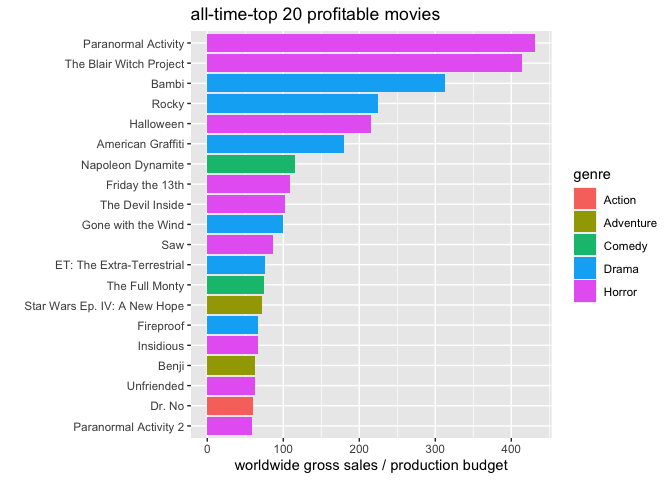
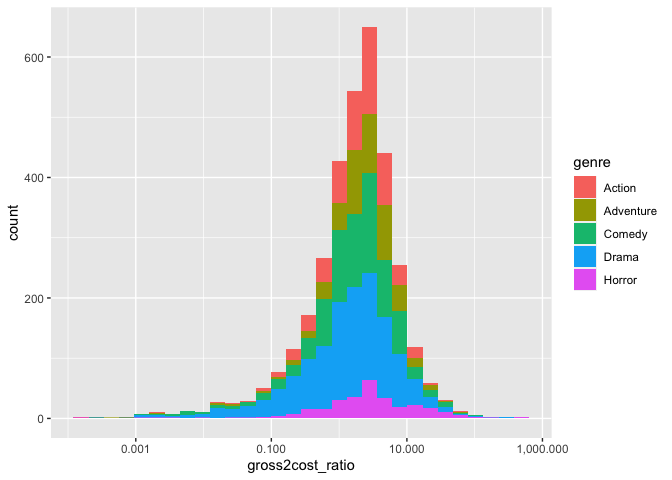
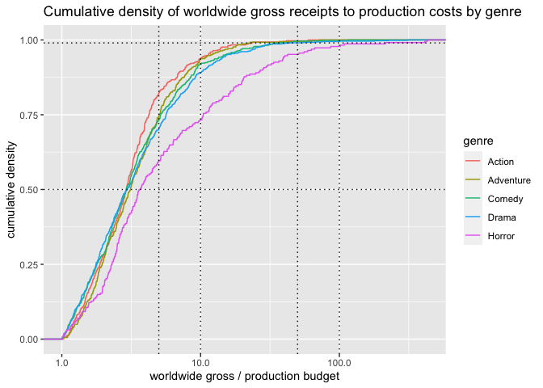

horror\_movie\_profits
================
ASG
6/3/2021

``` r
library(tidyverse)
```

    ## ── Attaching packages ─────────────────────────────────────── tidyverse 1.3.1 ──

    ## ✓ ggplot2 3.3.3     ✓ purrr   0.3.4
    ## ✓ tibble  3.1.2     ✓ dplyr   1.0.6
    ## ✓ tidyr   1.1.3     ✓ stringr 1.4.0
    ## ✓ readr   1.4.0     ✓ forcats 0.5.1

    ## ── Conflicts ────────────────────────────────────────── tidyverse_conflicts() ──
    ## x dplyr::filter() masks stats::filter()
    ## x dplyr::lag()    masks stats::lag()

``` r
library(scales)
```

    ## 
    ## Attaching package: 'scales'

    ## The following object is masked from 'package:purrr':
    ## 
    ##     discard

    ## The following object is masked from 'package:readr':
    ## 
    ##     col_factor

``` r
library(lubridate)
```

    ## 
    ## Attaching package: 'lubridate'

    ## The following objects are masked from 'package:base':
    ## 
    ##     date, intersect, setdiff, union

### The original TidyTuesday github page posits the question: scary-movies-are-the-best-investment-in-hollywood—fivethirtyeight

### getting the raw data

``` r
movie_profit <- read_csv("https://raw.githubusercontent.com/rfordatascience/tidytuesday/2e9bd5a67e09b14d01f616b00f7f7e0931515d24/data/2018/2018-10-23/movie_profit.csv") %>% 
select(-X1) %>% 
  mutate(release_date = mdy(release_date))
```

    ## Warning: Missing column names filled in: 'X1' [1]

    ## 
    ## ── Column specification ────────────────────────────────────────────────────────
    ## cols(
    ##   X1 = col_double(),
    ##   release_date = col_character(),
    ##   movie = col_character(),
    ##   production_budget = col_double(),
    ##   domestic_gross = col_double(),
    ##   worldwide_gross = col_double(),
    ##   distributor = col_character(),
    ##   mpaa_rating = col_character(),
    ##   genre = col_character()
    ## )

Before we get into distinct genres, we could ask the an obvious
question: what were the most profitable Hollywood movies made and what
genre are they?

### creating a gross2cost column

The ratio of worldwide\_gross divided by the production budget will give
an approximate measure of the profitability of a movie, not necessarily
the final profits from it. We also filter out movies that made no money
at all (worldwide\_gross has to be &gt; 0).

``` r
movie_profit<- movie_profit %>%
  filter(worldwide_gross > 0) %>% 
  mutate(gross2cost_ratio = worldwide_gross / production_budget) %>% 
  arrange(desc(gross2cost_ratio))
```

### Top 20 all-time profitable movies

What genre are the top 20 all time top profitable movies?

``` r
all_time_top_profitables <-movie_profit %>% 
  head(20)
```

``` r
all_time_top_profitables %>% 
  mutate(movie = fct_reorder(movie,gross2cost_ratio)) %>% 
  ggplot(aes(movie, gross2cost_ratio, fill = genre)) + 
  geom_col() +
  coord_flip() +
  labs(title = "all-time-top 20 profitable movies",
       y = "worldwide gross sales / production budget",
       x = "")
```

<!-- -->

9 out of the top 20 all-time profitable movies are horror flicks, the
remaining 11 include 6 dramas, 2 comedies, 2 adventures and 1 action
movie.

Is this statistically true? Are a majority of the most profitable movies
horror movies? To answer that, we need to look at the distribution of
profitable movies by genre

### looking at the gross sales to production cost ratio distribution

``` r
movie_profit %>% 
  ggplot(aes(gross2cost_ratio, fill = genre)) +
  geom_histogram() +
  scale_x_log10(labels = comma_format())
```

    ## `stat_bin()` using `bins = 30`. Pick better value with `binwidth`.

<!-- -->

The profits distribution above is log normally distributed and spans a
range of 7 orders of magnitude. From a gross2cost ratio of 0.0001
(1e-04) to 1000 (1e+03). To the eye, the distributions look
superimposed, which is misleading given the large range. We could
transform the distributions to cumulative, to bring out the differences.

### cumulative distribution of gross2cost ratio by genre

``` r
movie_profit %>% 
  ggplot(aes(gross2cost_ratio, color = genre)) +
  stat_ecdf() +
  facet_wrap(facets = vars(genre)) +
  scale_x_log10(labels = comma_format()) +
  labs(title = "Cumulative density of worldwide gross receipts to production costs by genre",
       y = "cumulative density",
       x = "worldwide gross / production budget") +
  geom_hline(yintercept = c(0.5, 0.99), linetype = 3) +
  geom_vline(xintercept = c(1,10,100), linetype = 3)
```

<!-- -->
As seen above, the horror flicks grossing in the top 25th percentile
have \~10 - \~100 fold sales over costs! The closest among other genres
are comedy movies with the top 25th percentile comedies grossing between
\~5 to \~20 fold sales over costs.

To examine this further, we filter out the loss making and least
profitable movies and re-plot the data

``` r
movie_profit %>% 
  arrange(desc(gross2cost_ratio)) %>% 
  filter(gross2cost_ratio > 1.001) %>% 
  ggplot(aes(gross2cost_ratio, color = genre)) +
  stat_ecdf() +
  scale_x_log10(labels = comma_format()) +
  labs(title = "Cumulative density of worldwide gross receipts to production costs by genre",
       y = "cumulative density",
       x = "worldwide gross / production budget") +
  geom_hline(yintercept = c(0.5, 0.99), linetype = 3) +
  geom_vline(xintercept = c(5,10,50,100), linetype = 3)
```

<!-- -->

We see that the horror movie profitability distribution stands out from
all other genres!

TBD

### Are there any distributors who have a special talent for picking profitable horror flicks?
