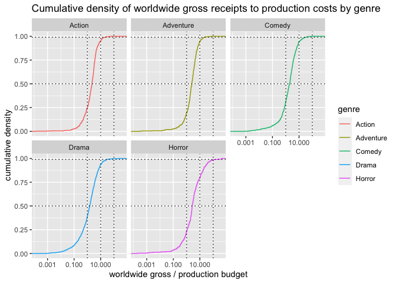

horror\_movie\_profits
================
ASG
6/3/2021

### Original dataset : <https://github.com/rfordatascience/tidytuesday/tree/master/data/2018/2018-10-23>

### The original TidyTuesday github page posits the question: scary-movies-are-the-best-investment-in-hollywood—fivethirtyeight

### getting the raw data

``` r
movie_profit %>% 
  head()
```

    ## # A tibble: 6 x 8
    ##   release_date movie production_budg… domestic_gross worldwide_gross distributor
    ##   <date>       <chr>            <dbl>          <dbl>           <dbl> <chr>      
    ## 1 2007-06-22   Evan…        175000000      100289690       174131329 Universal  
    ## 2 1995-07-28   Wate…        175000000       88246220       264246220 Universal  
    ## 3 2017-05-12   King…        175000000       39175066       139950708 Warner Bro…
    ## 4 2013-12-25   47 R…        175000000       38362475       151716815 Universal  
    ## 5 2018-06-22   Jura…        170000000      416769345      1304866322 Universal  
    ## 6 2014-08-01   Guar…        170000000      333172112       771051335 Walt Disney
    ## # … with 2 more variables: mpaa_rating <chr>, genre <chr>

As seen above, the dataset consists of \~3400 movies with some
associated data like release date, genre, production budget, US /
world-wide ticket sales etc.

Before we get into distinct genres, we could ask an obvious question:
what have been the most profitable Hollywood movies made until 2018 (the
database stops here) and what genre were they?

### creating a gross2cost column

The ratio of worldwide\_gross sales divided by the production budget
will give us an approximate measure of the profitability of a movie, not
necessarily the final profit. We also filter out movies that made no
money at all (worldwide\_gross has to be &gt; 0).

### Top 20 all-time profitable movies

What genre were the top 20 all time top profitable movies?

``` r
all_time_top_profitables <-movie_profit %>% 
  head(20)
```

``` r
all_time_top_profitables %>% 
  mutate(movie = fct_reorder(movie,gross2cost_ratio)) %>% 
  ggplot(aes(movie, gross2cost_ratio, fill = genre)) + 
  geom_col() +
  coord_flip() +
  labs(title = "all-time-top 20 profitable movies",
       y = "worldwide gross sales / production budget",
       x = "")
```

<!-- -->

Almost half (9/20) of the top 20 all-time profitable movies are horror
flicks (pink bars), the remaining 11 include 6 dramas, 2 comedies, 2
adventures and 1 action movie.

The top two movies “Paranormal Activity” and “The Blair Witch Project”,
both horror movies, sold tickets worth more than 400 times their
production cost!

Is this statistically true? Do most of the profitable horror movies make
much more money than the profitable movies from other genres? To answer
that, we need to look at the statistical distribution of profitable
movies by genre.

### looking at the gross sales to production cost ratio distribution

``` r
movie_profit %>% 
  ggplot(aes(gross2cost_ratio, fill = genre)) +
  geom_histogram() +
  scale_x_log10(labels = comma_format())
```

    ## `stat_bin()` using `bins = 30`. Pick better value with `binwidth`.

<!-- -->

The profits distribution above is log normally distributed and spans a
range of 7 orders of magnitude. From a gross2cost ratio of 0.0001
(1e-04) to 1000 (1e+03).

To the eye, all the distributions look superimposed and quite
misleading, given the logarithmic X axis. Also, the number of horror
movies that have been made is much smaller than the number of movies
made in the other genres.

We could transform the distributions to cumulative and normalize the
data (get rid of the numbers discrepancy), to bring out the differences
in profits made by each genre.

### Normalized cumulative distribution of gross2cost ratio by genre

``` r
movie_profit %>% 
  ggplot(aes(gross2cost_ratio, color = genre)) +
  stat_ecdf() +
  facet_wrap(facets = vars(genre)) +
  scale_x_log10(labels = comma_format()) +
  labs(title = "Cumulative density of worldwide gross receipts to production costs by genre",
       y = "cumulative density",
       x = "worldwide gross / production budget") +
  geom_hline(yintercept = c(0.5, 0.99), linetype = 3) +
  geom_vline(xintercept = c(1,10,100), linetype = 3)
```

<!-- -->
As seen above, the horror flicks grossing in the top 25th percentile had
\~10 - \~100 fold sales over costs! The closest among other genres are
comedy movies with the top 25th percentile comedies grossing between \~5
to \~20 fold sales over costs.

To examine this further, we filter out the loss making and least
profitable movies and re-plot the data

``` r
movie_profit %>% 
  arrange(desc(gross2cost_ratio)) %>% 
  filter(gross2cost_ratio > 1.001) %>% 
  ggplot(aes(gross2cost_ratio, color = genre)) +
  stat_ecdf() +
  scale_x_log10(labels = comma_format()) +
  labs(title = "Cumulative density of worldwide gross receipts to production costs by genre",
       y = "cumulative density",
       x = "worldwide gross / production budget") +
  geom_hline(yintercept = c(0.5, 0.99), linetype = 3) +
  geom_vline(xintercept = c(5,10,50,100), linetype = 3)
```

<!-- -->

We see that the horror movie profitability distribution stands out from
all other genres! The median horror flick made \~ 4 times production
cost in sales (i.e \~ 400 % gross profit) compared to a median comedy
movie which made \~ 2 fold sales over costs.

The top horror flicks (99th percentile) made over 400 times production
costs (an astonishing 40,000 % gross profit) compared to the top
grossing comedy movies that, at best, made 30 times costs or \~ 3000 %
gross profit.

Clearly, horror movies are the best genre to invest money in!

TBD

### Are there any distributors who have a special talent for picking profitable horror flicks?
